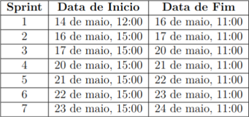
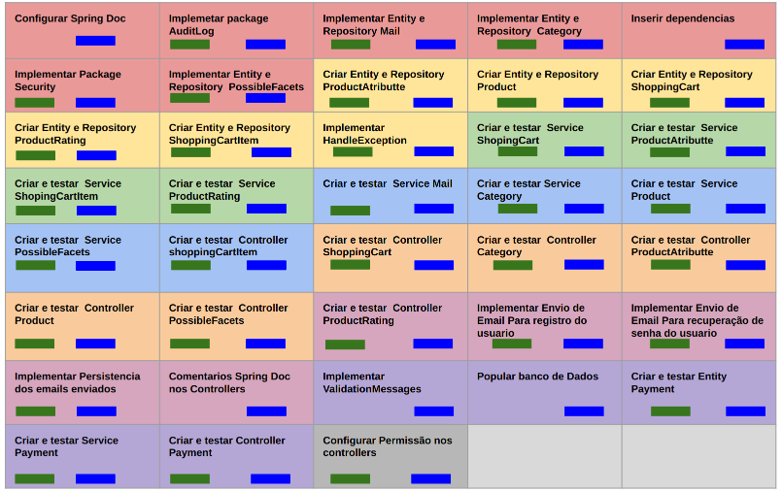
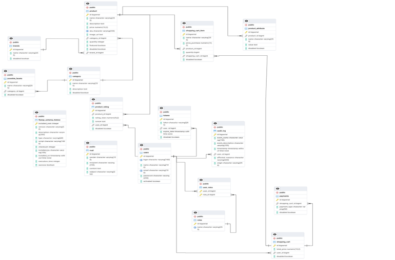

# Atualização do Sistema de E-commerce

## Descrição do Projeto

O projeto consiste na modernização de um sistema de e-commerce estabelecido há cinco anos, originalmente focado na venda de relógios, laptops e smartphones. A atualização visa alinhar o sistema com as novas diretrizes do modelo de negócios da empresa, direcionando-o para a venda de produtos tecnológicos de alto valor agregado, como servidores das marcas Dell e Positivo.

A modernização inclui a atualização do framework Java, otimização do backend, remodelagem do banco de dados e a implementação de novas funcionalidades para garantir segurança, escalabilidade e competitividade no mercado B2B.

## Equipe

- **Líder Técnico:** João Vitor Nascimento Ramos
- **Integrantes:**
  - Ian Rodrigues Alexandrino
  - Leonardo Ribeiro Barbosa Santos
  - Murilo Carlos Novais
  - Renata C. de Oliveira Moreno
  - Danilo da Conceição Santos
  - Alexandre de Souza Amaral

## Apresentação do Problema

O sistema atual enfrenta desafios devido à utilização de tecnologias desatualizadas, como a versão 2.1.1 do Spring Boot, que não recebe mais atualizações de segurança desde dezembro de 2019. Além disso, o uso de um banco de dados MongoDB sem esquema estruturado dificulta a manutenção e a consistência dos dados. A atualização visa resolver esses problemas e implementar melhorias significativas.

## Pontos Negativos Identificados

1. **Versão do Spring Boot:** A versão 2.1.1 está desatualizada e não recebe mais suporte.
2. **Banco de Dados MongoDB:** A falta de um esquema estruturado dificulta a manutenção e a consistência dos dados.
3. **Dependências Desatualizadas:** Versões antigas de dependências podem causar vulnerabilidades e incompatibilidades.

## Planejamento de Melhorias

- Atualização da versão do Spring Boot.
- Atualização das dependências.
- Re-modelagem do sistema para um banco de dados relacional PostgreSQL.
- Inserção de novas dependências ao projeto.
- Aplicação de padrões de projeto nas verificações de dados em transições de cadastro, update e delete.
- Implementação de um sistema de auditoria com `IpAddressInterceptor` para logs no banco de dados.
- Expansão do uso de Spring Security para funcionalidades de segurança do sistema.

## Metodologia de Gerenciamento

O projeto foi gerenciado utilizando a metodologia Scrum, com o auxílio do Trello para organização das tarefas. A equipe foi dividida em sub-equipes de duas pessoas para programação em pares, garantindo agilidade e mitigação de atrasos. Reuniões diárias foram realizadas para acompanhamento do progresso e resolução de impedimentos.

## Divisão das Sprints e Backlog

## Modelo do Banco de Dados

## Funcionalidades Desenvolvidas

### Segurança
- Registro de usuário
- Ativação do usuário
- Login
- Recuperação de senha

### Brand
- Registrar Brand
- Buscar Brand por ID
- Buscar todas as Brands
- Atualizar Brand
- Desabilitar Brand

### Category
- Registrar Category
- Buscar Category por ID
- Buscar todas as categories
- Buscar categorias por nome
- Atualizar Category
- Desabilitar Category

### PossibleFacets
- Registrar Atributo de categoria
- Buscar Todas as PossibleFacets
- Buscar PossibleFacets por ID
- Buscar possibleFacets por categoria
- Atualizar PossibleFacets
- Desabilitar PossibleFacets

### Produto
- Registrar Produto
- Listar Produtos
- Buscar Produto por ID
- Buscar Produtos por Categoria
- Atualizar Produto
- Desabilitar Produto

### ProductAttribute
- Registrar ProductAttribute
- Listar ProductAttributes
- Listar ProductAttributes Desabilitados
- Buscar ProductAttributes por ID
- Buscar ProductAttributes por Produto
- Buscar ProductAttributes Desabilitados por Produto
- Atualizar ProductAttribute
- Desabilitar ProductAttribute

### Avaliação de Produto
- Registrar Avaliação de Produto
- Listar Avaliações de Produto
- Buscar Avaliação de Produto por ID
- Buscar Avaliações por Produto
- Buscar Avaliações por Usuário
- Atualizar Avaliação de Produto
- Desabilitar Avaliação de Produto

### Compra e Pagamento
- Realizar Compra
- Cancelar Compra
- Registrar Pagamento
- Listar Todos os Pagamentos
- Listar Pagamentos por Usuário
- Desabilitar Pagamento

## Documentação do Projeto

A documentação completa do projeto, incluindo o relatório técnico e diagramas de sequência, está disponível na pasta `Documentacao`. Abaixo está a estrutura de arquivos relevantes:

### Estrutura de Arquivos Relevantes
Documentacao/
├── Relatório_de_Desenvolvimento___Shopping_Store.pdf
├── ShoppingStore Apresentação.pdf
└── ShoppingStore Apresentação.pptx

- **Relatório Técnico:** O arquivo `Relatório_de_Desenvolvimento___Shopping_Store.pdf` contém uma descrição detalhada do projeto, incluindo objetivos, desafios, soluções implementadas e resultados obtidos.

- **Apresentações:** Os arquivos `ShoppingStore Apresentação.pdf` e `ShoppingStore Apresentação.pptx` fornecem uma visão geral do projeto, com foco nas decisões técnicas e no planejamento.

